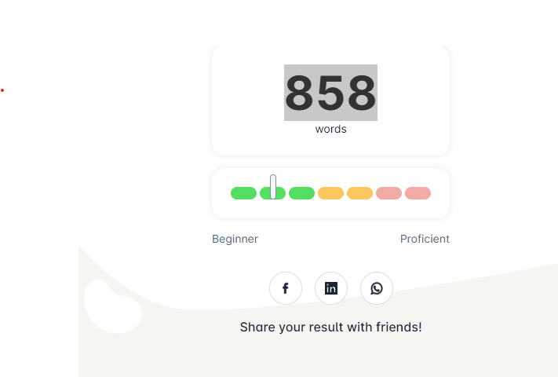

## 缘起与学习目标

目前英语水平基本为0。目标是：
- 今年年底能流畅阅读技术英文文档，例如：[ECK Quickstart](https://www.elastic.co/guide/en/cloud-on-k8s/current/k8s-quickstart.html)

## 学习方法
2023/6 [英语：壹章 - 恶魔奶爸](https://zhuanlan.zhihu.com/p/19768351)：针对零基础/基础超级不好的同学

## 词汇量测试
测试地址：[test-your-vocab](https://preply.com/en/learn/english/test-your-vocab)
- 2023/5/30 词汇量 858

